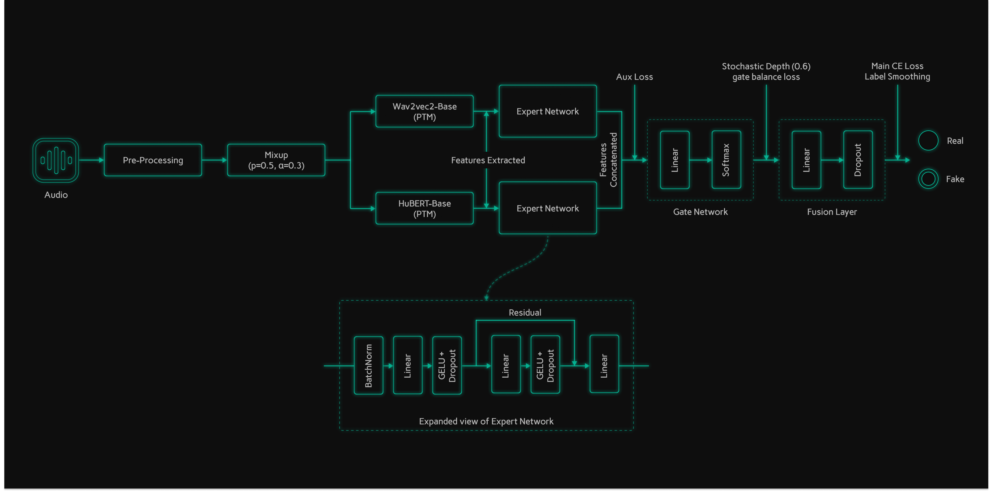

Hindi Audio Deepfake Detection — Mixture of Experts (MoE)

## Table of Contents
- [Summary](#1-introduction)
- [Demo Video](#2-demo-video)
- [Performance & Architecture Highlights](#3-performance--architecture-highlights)
- [Architecture Diagram](#4-architecture-diagram)
- [Datasets (Real + Fake)](#5-datasets-real--fake)
- [Simulated Attacks](#6-simulated-attacks)
- [Preprocessing Profiles](#7-preprocessing-profiles)
- [Feature Extraction (HuBERT + Wav2Vec2)](#8-feature-extraction-hubert--wav2vec2)
- [Model Architecture (MoE)](#9-model-architecture-moe)
- [Results (Your Run)](#10-results-your-run)
- [Local XAI (App)](#11-local-xai-app)
- [Global XAI (Dataset-Level)](#12-global-xai-dataset-level)
- [Features](#13-features)
- [Tech Stack](#14-tech-stack)
- [Project Structure](#15-project-structure)
- [Installation](#16-how-to-run-the-app)
- [Training & Evaluation](#17-training--evaluation)
- [Future Improvements](#18-future-improvements)

## 1. Introduction

A full-stack **Hindi voice deepfake detector** built around a **Mixture-of-Experts (MoE)** model that combines two pretrained audio representation models:

- **HuBERT** (acoustic-focused)
- **Wav2Vec2** (linguistic-focused)

The system provides:

- A **FastAPI backend** for inference + explainability
- A **React (Vite) frontend** with a premium XAI dashboard
- Both **Local XAI** (per sample) and **Global XAI** (dataset-level analysis)


## 2. Demo Video

[Demo video]

## 3. Performance & Architecture Highlights

### Architectural Highlights

* **Dual-PTM MoE Ensemble:** The model routes between HuBERT and Wav2Vec2 expert logits using a learned gate.

* **Pooled Feature Design (1536-D per expert):** Each PTM produces pooled statistics (mean + std), enabling fast inference while trading off true temporal interpretability.

* **Hindi Language Gate (LID):** A lightweight language check is performed on *clean* audio before expensive preprocessing + MoE inference.

* **XAI Built-in:**
  * **Local XAI:** Temporal score heatmap (true temporal via re-extraction), frequency contribution, integrated gradients, SHAP-style expert contributions.
  * **Global XAI:** Dataset-level temporal patterns, spectral band statistics (mean/variance), suspicious frequency bands, expert SHAP summaries, integrated gradients summaries, and spectrogram difference maps.


## 4. Architecture Diagram




## 5. Datasets (Real + Fake)

This project is built around a curated Hindi corpus with **real human speech** and **synthetic TTS speech**, constructed via the notebooks in the repo.

### 5.1 Real (Authentic) Speech Sources

Built in `authentic_dataset_construction.ipynb`.

- **IndicVoices-R (Hindi)**
  - Saved under `raw/real_clean/ivr/`
  - Notebook target: ~30 hours

- **IndicTTS-Hindi (studio recordings)**
  - Saved under `raw/real_clean/indictts/`
  - Notebook target: ~10.5 hours

- **Mozilla Common Voice (Hindi)**
  - Saved under `raw/real_clean/commonvoice/`
  - Notebook target: ~15 hours (your captured run shows ~12.62 hours saved)

- **Google FLEURS (Hindi, hi_in)**
  - Saved under `raw/real_clean/thirdparty/fleurs_hi_in/`
  - Used mainly as an **unseen speaker** third-party test source

All real sources are indexed in a master manifest:

- `metadata/master_real.csv`

### 5.2 Fake (Synthetic) Speech Sources

Built in `synthetic_dataset_construction.ipynb`.

- **Edge-TTS (Microsoft neural voices)**
  - Saved under `raw/fake_tts/`
  - Labeled in `metadata/master_fake.csv` with `fake_type=tts_edge`
 
- **MMS-TTS (Meta, `facebook/mms-tts-hin`)** 
  - Saved under `raw/fake_tts_mms/`
  - Used as a **held-out TTS family** for generalization testing
 
All fake sources are indexed in:
 
- `metadata/master_fake.csv`

### 5.3 Train/Val/Test Splits

The training script prints split sizes from CSVs you pass in.

From your run log:

- **Train:** 83,135 (real=42,483, fake=40,652)
- **Val:** 9,237 (real=4,721, fake=4,516)
- **Test (clean):** 6,024 (real=3,022, fake=3,002)


## 6. Simulated Attacks

To simulate real-world degradation (codecs / channel constraints), the notebook `simulated_attacks.ipynb` generates “attacked” audio variants and writes them under:

- `processed/attacks/<attack_name>/...`

Two key attacks used in the notebook:

- **Opus compression:** `opus16` (Opus @ 16k bitrate)
- **Channel / bandwidth constraint:** `lp8k` (low-pass @ 8 kHz)

Attacked files are indexed in:

- `metadata/attacks.labeled.csv`


## 7. Preprocessing Profiles

The project uses multiple preprocessing profiles so training is robust while evaluation stays realistic.

### 7.1 Base Profile (Normalization)

Implemented in `preprocessing.ipynb`.

Typical steps:

- Resample to 16 kHz, mono
- High-pass at 20 Hz
- Per-file loudness normalization (target RMS, e.g. -26 dB)
- Silence trimming (head/tail)

Output:

- `processed/wav/base/...`

### 7.2 Strong Profile (Training Robustness)

Used to stress the model during training with stronger signal shaping.

In the backend inference pipeline, the “strong” filter chain is in:

- `backend/preprocess_strong.py`

It uses ffmpeg to apply:

- High-pass at 20 Hz
- Artifact-emphasizing EQ boosts (3–6 kHz region)
- Gain normalization + silence removal

### 7.3 Clean Profile (Evaluation)

Evaluation scripts and test CSVs are designed around a cleaner, less-augmented profile for measuring generalization.


## 8. Feature Extraction (HuBERT + Wav2Vec2)

Both backend inference and training rely on pooled embeddings from two pretrained transformer audio models (“PTMs”):

- **HuBERT** (`facebook/hubert-base-ls960`)
- **Wav2Vec2** (`facebook/wav2vec2-base`)

### 8.1 What features look like

The feature extractor computes hidden states and pools them into a single fixed-size vector:

- Mean over time (768)
- Std over time (768)

Concatenated:

- **1536 dims per PTM**

Backend implementation:

- `backend/ptm_feat.py`

Key controls:

- `PTM_LASTK` env var controls how many last layers to pool.


## 9. Model Architecture (MoE)

The classifier is a **Mixture-of-Experts** over two PTM feature vectors.

Core idea:

- Each PTM has an **expert MLP** producing logits
- A **gate network** predicts mixing weights from the concatenated PTM embeddings
- Final logits are the weighted sum of expert logits

Backend inference model definition:

- `backend/moe_model.py`

Training model definition:

- `train_moe.py` (includes training-time options such as stochastic depth and fusion)


## 10. Results 


```text
(.venv) (base) PS C:\Users\pc 1\hindi_df> python train_moe.v4.py `
  --train-csv "G:\My Drive\hindi_dfake\metadata\split_train.labeled.csv" `
  --val-csv   "G:\My Drive\hindi_dfake\metadata\split_val.labeled.csv" `
  --test-real-csv "G:\My Drive\hindi_dfake\metadata\fs_test_real.labeled.csv" `
  --test-fake-csv "G:\My Drive\hindi_dfake\metadata\fs_test_fake_mms.labeled.csv" `
  --batch-size 512 `
  --num-workers 2 `
  --calibrate

[env] device= cuda | cuda_available= True | gpu= NVIDIA GeForce GTX 1650
[ptm columns] wav2vec2-base -> vec_wav2vec2-base | hubert-base -> vec_hubert-base
[split files in use]
 train_csv     : ... | rows=83,135 (real=42,483 fake=40,652)
 val_csv       : ... | rows=9,237 (real=4,721 fake=4,516)
 test_real_csv : ... | rows=3,022
 test_fake_csv : ... | rows=3,002
 combined test : 6,024 rows

[v5 config] Mixup=0.30 (prob=0.5) | StochDepth=0.6 | FusionDrop=0.5 | LabelSmooth=0.1
...
Early stopping at epoch 12. Best val EER=0.0006

[RESULTS]
 Best Val EER : 0.0006
 Test EER     : 0.0800 (thr@eer=0.108945)
 Acc@0.5      : 0.5058 | Error@0.5     : 0.4942
 Acc@thrEER   : 0.9200 | Error@thrEER : 0.0800

[MMS calibration (on combined test)]
  dev_frac=0.20 | dev_n=1204 | holdout_n=4820
  Calibrated thr=0.111145 (dev best acc=0.9311)
  Holdout Acc   =0.9178 | Holdout Error =0.0822
```


## 11. Local XAI (App)

Local XAI is computed per uploaded audio sample through the backend and visualized in the frontend.

### 11.1 Backend endpoints

Defined in `backend/app.py`:

- `POST /infer`
  - Runs language gate (Hindi check)
  - Runs preprocessing
  - Extracts PTM features
  - Runs MoE inference and returns `P(fake)` + gate weights

- `POST /xai`
  - Reuses cached inference data and produces:
    - **Temporal heatmap** (true temporal: sliding-window re-extraction)
    - **Frequency contribution** (mel-spectrogram + suspicious bands; model-independent)
    - **Expert agreement** (per-expert outputs)
    - **Integrated gradients** (feature-dimension attribution)
    - **Expert Shapley contributions** (SHAP-like over experts)

- `POST /xai/export`
  - Produces a ZIP of plots (generated by `backend/export_xai_plots.py`)

### 11.2 What the XAI means (important limitation)

Because the model uses pooled PTM embeddings (mean+std), most gradient-based methods explain **feature dimensions**, not time.

- **True temporal XAI**: `compute_temporal_heatmap()` re-extracts features over sliding windows.
- **Feature-dimension XAI**: Integrated Gradients, Gradient×Input, and SHAP-like are over pooled embedding dimensions.


## 12. Global XAI (Dataset-Level)

Global XAI aggregates patterns over a labeled dataset and exports a single JSON.

Script:

- `global_xai.py`

Output:

- `<output-dir>/global_xai_results.json`

This report includes:

- **Temporal patterns** (avg/variance of detection scores over positions)
- **Frequency band statistics** (mean/variance by band)
- **Suspicious low-variance band detection**
- **Expert Shapley summaries** (expert-level contributions)
- **Integrated gradients summaries**
- **Spectrogram difference maps** (real vs fake)

The frontend loads the global JSON from:

- `frontend/public/global_xai_results_seed1/global_xai_results.json`


## 13. Features

### Core App Features

* **Upload & Classify Audio:** Returns `P(fake)`, predicted label, threshold, uncertainty, and expert gate weights.

* **Hindi Language Validation:** Rejects non-Hindi audio early with diagnostic info.

* **Local XAI (Per Sample):**
  * Temporal consistency heatmap (sliding-window inference)
  * Frequency contribution analysis
  * Integrated Gradients feature attribution
  * SHAP-like expert contribution decomposition
  * Exportable plots (ZIP)

* **Global XAI (Dataset-Level):**
  * Aggregated temporal feature importance
  * Spectral band mean/variance comparisons
  * Suspicious low-variance band detection
  * Linguistic marker correlation table
  * Expert SHAP summaries
  * Integrated gradients aggregate curves
  * Spectrogram difference heatmap


## 14. Tech Stack

* **Frontend:** React (Vite), TailwindCSS, Recharts

* **Backend:** FastAPI, Uvicorn

* **ML / Audio:** PyTorch, HuggingFace Transformers (HuBERT + Wav2Vec2), librosa, soundfile

* **Language ID:** faster-whisper

* **Visualization:** matplotlib, seaborn


## 15. Project Structure

```
.
├── backend/                         # FastAPI server + inference + XAI
│   ├── app.py                       # API endpoints: /infer, /xai, /xai/export
│   ├── start.ps1                    # Windows start script for uvicorn
│   ├── requirements.txt             # Backend dependencies
│   ├── moe_model.py                 # MoE model definition (inference)
│   ├── ptm_feat.py                  # HuBERT/Wav2Vec2 pooled feature extraction
│   ├── preprocess_strong.py         # Audio preprocessing used for inference
│   ├── xai_analysis.py              # Temporal heatmap + frequency-based analysis
│   ├── xai_advanced.py              # Integrated Gradients + SHAP-like + Grad×Input
│   └── export_xai_plots.py          # Plot export (ZIP)
│
├── frontend/                        # React UI dashboard
│   ├── src/
│   └── public/
│       └── global_xai_results_seed1/
│           └── global_xai_results.json
│
├── train_moe.py                     # MoE training (v5 config)
├── evaluate_moe_clean_profile.py    # Clean test evaluation + plots
├── global_xai.py                    # Dataset-level global XAI analysis
│
├── ptm/                             # Local PTM feature cache (used by eval scripts)
├── metadata/                        # CSVs, splits, manifests, calibration
├── models/                          # Training checkpoints
├── figures_clean_profile/           # Evaluation plots output
│
├── authentic_dataset_construction.ipynb
├── synthetic_dataset_construction.ipynb
├── preprocessing.ipynb
├── simulated_attacks.ipynb
│
├── architecture_diagram.png
└── Voice Deepfake Detector - Google Chrome 2026-01-05 23-42-23.mp4
```


## 16. How to Run the App

### Prerequisites

* Python 3.10+
* Node.js 18+
* **ffmpeg** available in PATH (backend uses it to normalize uploads)
* (Optional) NVIDIA CUDA for faster inference

### Step 1: Backend setup

Create and activate a Python environment, then install backend dependencies:

```bash
pip install -r backend/requirements.txt
```

Important notes:

- `backend/requirements.txt` includes core runtime dependencies (including **PyTorch** and **scikit-learn**).
- Training/evaluation scripts may require additional packages depending on your workflow (for example, GPU-enabled PyTorch builds, CUDA toolkits, etc.).
- On Windows, HuggingFace symlink warnings are handled via environment variables.

### Step 2: Configure backend environment

Backend config is read from `backend/.env`.

Current keys (example from this repo):

- `HF_HOME` — HuggingFace cache directory
- `PTM_LASTK` — how many last hidden layers to pool for PTM features
- `TEST_CSV` — test CSV used to display ground-truth in UI
- `CALIB_JSON` — calibration manifest containing a calibrated threshold
- `DEFAULT_THR`, `MMS_FALLBACK_THR`, `FORCE_MMS`, `APP_BUILD`

Also note:

- `backend/app.py` currently uses a hardcoded dataset root:
  - `ROOT = G:\My Drive\hindi_dfake`
  If your paths differ, update `ROOT` (and related paths) or align your data layout.

### Step 3: Start the backend

From the `backend/` folder in PowerShell:

```powershell
./start.ps1
```

Backend will start on:

- `http://localhost:8000`

Health endpoint:

- `GET /health`

### Step 4: Frontend setup

From the `frontend/` folder:

```bash
npm install
npm run dev
```

Open:

- `http://localhost:5173`


## 17. Training & Evaluation

### 9.1 Training (MoE)

Train script: `train_moe.py`

Key CLI options (defaults point to your `metadata/` CSVs):

- `--train-csv`, `--val-csv`
- `--test-real-csv`, `--test-fake-csv`
- `--ptms` (comma-separated, default: `wav2vec2-base,hubert-base`)
- `--batch-size`, `--lr`, `--max-epochs`, etc.

Example:

```bash
python train_moe.py \
  --train-csv metadata/split_train.labeled.csv \
  --val-csv metadata/split_val.labeled.csv \
  --test-real-csv metadata/fs_test_real.labeled.csv \
  --test-fake-csv metadata/fs_test_fake_mms.labeled.csv \
  --run-name moe_ptm2_v5_aggressive
```

Outputs:

- Checkpoints in `models/`
- Run manifest JSON in `metadata/runs/<run_name>_manifest.json`

* **Important XAI limitation:** The MoE uses pooled PTM features (mean + std). As a result:
  - Integrated Gradients / SHAP in this project explain **feature-dimension importance**, not true time-importance.
  - True temporal explanations require re-extracting features over sliding windows (more expensive), which is what `compute_temporal_heatmap()` does.

* **ffmpeg required:** Backend uses ffmpeg to normalize input audio to mono 16kHz.

* **Windows + HuggingFace:** `backend/start.ps1` and `backend/env_setup.py` set `HF_HUB_DISABLE_SYMLINKS=1` to avoid symlink issues.


## 18. Future Improvements

- **Data scaling & diversity**: add more unseen speakers, accents/dialects, and recording conditions (phone mics, noisy environments) for better generalization.
- **Broader synthetic coverage**: include more TTS/VC model families (and different vocoders) to reduce overfitting to a narrow deepfake style.
- **Attack robustness suite**: standardize evaluation across codecs/bitrate, resampling, additive noise, reverberation, clipping, and channel filters (in addition to `opus16`/`lp8k`).
- **Stronger temporal modeling**: move from pooled mean/std-only features to time-aware pooling (attention pooling, TCN/Transformer over frame embeddings) to improve temporal discrimination and temporal XAI.
- **Calibration improvements**: evaluate temperature scaling / isotonic regression on a proper dev split and track calibration metrics (ECE/Brier).
- **Multi-task learning**: predict `real/fake` and `fake_type` (Edge vs MMS vs other) to improve internal representations.
- **Deployment hardening**: add API rate limits, file size limits, timeouts, and background job queues for heavy XAI/export operations.
- **XAI validation**: add sanity checks (randomization tests), stability metrics, and a small human study to validate explanation usefulness.
